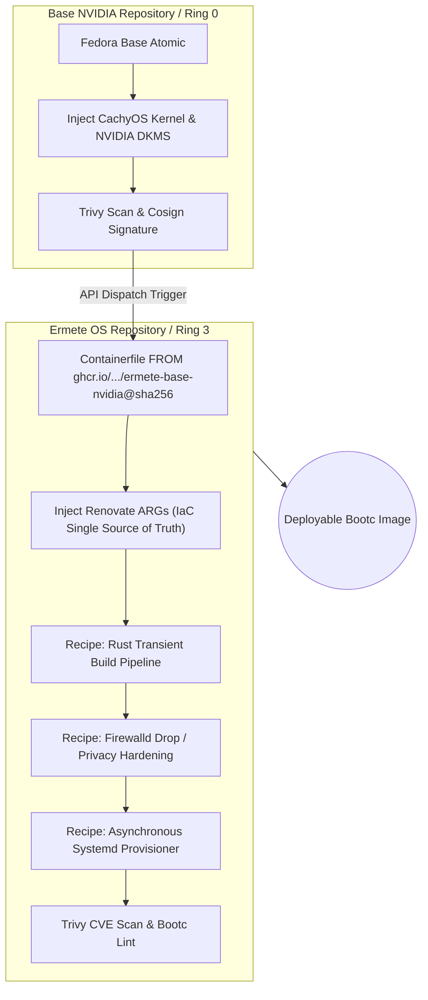

<div align="center">
  <h1>🦅 Ermete OS (Layer 1: Ring 3)</h1>
  <p><b>An uncompromising, cloud-native, atomic Linux distribution engineered for power-users.</b></p>
</div>

---

**Ermete OS** is a hyper-optimized, immutable operating system built upon Fedora and Universal Blue (`bootc`) technologies. It discards monolithic desktop environments, replacing them with a surgically thin, keyboard-driven Wayland experience written almost entirely in Rust.

Driven by an absolute **Infrastructure-as-Code (IaC)** philosophy, Ermete OS is defined entirely by OCI container recipes. It guarantees unbreakable atomic updates, zero system entropy, and uncompromising privacy.

## 🏗️ Multi-Layer OCI Architecture
Ermete OS strictly follows a multi-repository, decoupled architecture for ultimate determinism.



## 🌟 The Enterprise Manifesto

1. **Zero-Entropy**: The root filesystem is strictly immutable. No system degradation, rot, or state drift over time. Software installation via `dnf` on the live system is mathematically banned.
2. **Zero-Bloat**: Only CLI tools and core infrastructure exist on the host. Weak dependencies are banned (`install_weak_deps=False`).
3. **100% Verified Supply Chain**: Dynamic `curl | bash` or blind binary downloads are forbidden. External binaries are managed via a centralized `Containerfile ARG` manifest. The entire OS is pinned exclusively to immutable cryptographic digests (`@sha256`), eliminating reliance on mutable tags like `:latest`.
4. **Autonomous Maintenance**: The OS heals and updates itself via the native `bootc-fetch-apply.timer`. Renovate Bot detects upstream releases, recalculates SHA256 hashes, and pins Docker images. The pipeline compiles, scans with **Trivy** to block CVEs, and signs the deployment via Sigstore/Cosign OIDC without manual intervention.

---

## 🛡️ Paranoid Hardening & "Zero-Trust" Security

Ermete OS implements extreme military-grade security defaults, completely overhauling standard Linux paradigms. It ensures maximum operability while remaining an impenetrable fortress.

### 1. Network Stealth & Isolation
- **Firewall**: Default zone is strictly `drop`. All unsolicited traffic is annihilated without response. mDNS is surgically permitted for local discovery.
- **Privacy Enforcement**: NetworkManager enforces MAC Address Randomization (`stable`) and IPv6 Privacy (`ipv6.ip6-privacy=2`).
- **DNS Protection**: `systemd-resolved` strictly uses `DNSOverTLS=opportunistic` and disables local poisoning via `LLMNR=no`.

### 2. Core & Kernel Defenses
- **Sysctl Hardening**: Mitigates 0-days with `tcp_syncookies=1`, blocks ICMP redirects to prevent MITM attacks, restricts dmesg (`dmesg_restrict=1`), and shields kernel pointers (`kptr_restrict=2`).
- **Memory Coredumps Disabled**: `systemd-coredump` is neutralized (`Storage=none`, `ProcessSizeMax=0`) to ensure Wayland crashes never leak RAM secrets or cryptographic keys to the disk.
- **Anti-DoS Journaling**: `systemd-journald` is capped to `500M` and 1-month retention, preventing malicious processes from exhausting the BTRFS root.
- **SSHD Zero-Trust**: If enabled, SSH rejects root login and completely disables password authentication, requiring modern Pubkey Authentication (Ed25519).

### 3. Local Authentication Sandbox (PAM)
- **Brute-Force Defense**: `faillock.conf` locks user and root accounts for 15 minutes after 3 failed login attempts.
- **Password Quality**: `pwquality.conf` enforces a minimum of 14 characters and 3 class types.

### 4. Self-Healing & Resilience
- **Greenboot Rollbacks**: If the OS fails to reach the network (checked via a 10s cryptographic curl timeout to 1.1.1.1) or the Wayland UI (`greetd`) fails, the system automatically logs the failure and performs a native OSTree rollback to the previous working layer.
- **BTRFS Snapshots**: Instead of arbitrary timers, `/var/home` backups (`ermete-home-snapshot.service`) are elegantly tied to `ostree-finalize-staged.service`, capturing the state precisely milliseconds before an OTA update is applied.

---

## ⚡ Extreme Performance & Wayland Stack
- **ZRAM Compressed Memory**: 100% RAM allocation dynamically compressed via **ZSTD** (`vm.swappiness=150`).
- **Systemd User Orchestration**: The Wayland compositor (Niri) does not spawn processes imperatively. Everything is handled cleanly by `systemd --user` binding to `niri-session.target`, ensuring graceful teardown and infinite idempotency.
- **The Stack**:
  - Compositor: **Niri** (Scrollable Tiling). Hardware accelerated with `GBM_BACKEND=nvidia-drm` and `WLR_NO_HARDWARE_CURSORS=1`.
  - Status Bar: **Ironbar** (Floating, transparent).
  - App Launcher: **Anyrun** (Compiled offline dynamically).
  - Terminal: **Foot** (Wayland native, C-based, lightweight).

---

## 📦 Segregated Software Management
Due to root immutability, the traditional `.exe` or `dnf install` paradigm is obliterated:
1. **Graphical Applications**: Exclusively confined to **Flatpak** (via Flathub). Protected globally by `flatpak override --system --device=dri --socket=wayland` to guarantee NVIDIA GPU acceleration and Wayland IPC sandboxing.
2. **CLI Utilities & Compilers**: Managed dynamically and declaratively via the **Nix** Package Manager (seamlessly exposed in `/etc/profile.d/nix.sh`), without installing any daemons.

---

## 🧬 Layer 0 & 1: Bill of Materials (BOM) & Architettura Interna
Essendo Linux estremamente modulare, mostriamo esattamente cosa gira sotto la scocca di Ermete OS e **perché**. Ogni pacchetto è stato scelto o scartato seguendo le regole ferree di Zero-Bloat e Immutabilità.

### 🛡️ Layer 0: La Bedrock (Ring 0 / Kernel & Core)
Questi pacchetti formano l'infrastruttura di base (Bootable OCI), focalizzata su prestazioni estreme e sicurezza crittografica. Nessuna interfaccia grafica è ammessa qui.

1. **Kernel CachyOS (`kernel-cachyos`) & NVIDIA (`dkms`, `akmods`)**:
   - *Perché*: Il kernel CachyOS fornisce lo scheduler BORE e compilazione x86-64-v3 per massima responsività. I driver NVIDIA sono compilati offline (DKMS) per garantire Zero-Boot-Delay al deploy.
2. **Schedulazione e-BPF (`scx-scheds`, `scx-tools`)**:
   - *Perché*: Gestisce il multi-tasking a livello di spazio utente tramite eBPF, surclassando lo scheduler nativo CFS in contesti di heavy-load.
3. **Firmware & Security (`fwupd`, `mokutil`, `sbsigntools`)**:
   - *Perché*: `fwupd` garantisce aggiornamenti BIOS/UEFI fluidi. `sbsigntools` e `mokutil` servono alla firma offline del kernel custom (MOK) per mantenere il Secure Boot inespugnabile.
4. **Filesystem & Crittografia (`btrfs-progs`, `squashfuse`, `libxcrypt-compat`)**:
   - *Perché*: BTRFS garantisce snapshot atomici sub-millisecondo in sinergia con OSTree.
5. **Networking (`NetworkManager`, `systemd-resolved`)**:
   - *Perché*: Gestione delle reti con hardening MAC address randomization e DNS-over-TLS nativo (via `opportunistic` in resolved).

### 🖥️ Layer 1: L'Abitacolo (Ring 3 / Desktop & App)
Lo stack user-space, costruito senza far uso di pesanti "Desktop Environment" legacy.

1. **Wayland Compositor Stack (`niri`, `xorg-x11-server-Xwayland`)**:
   - *Perché*: Niri fornisce un'interfaccia scrollable-tiling guidata da tastiera, leggerissima (Rust). XWayland è mantenuto isolato solo per retrocompatibilità con binari legacy.
2. **Terminal & Core Utils (`foot`, `eza`, `bat`, `fd-find`, `ripgrep`, `nushell`)**:
   - *Perché*: Abbiamo eradicato il vecchio stack GNU coreutils in favore di tool scritti in Rust, sicuri per la memoria, asincroni e parallelizzati, eliminando vulnerabilità zero-day native. Foot fornisce un terminal emulator iper-ottimizzato nativo Wayland in C.
3. **Interfaccia Grafica Modulare (`anyrun`, `ironbar`, `swaybg`, `swaync`)**:
   - *Perché*: Niente pannelli pesanti. `ironbar` fa da barra di stato nativa Wayland, `anyrun` è un lanciatore velocissimo scritto in Rust, `swaync` gestisce le notifiche tramite `systemd --user`.
4. **Autenticazione & Polkit (`lxpolkit`, `seahorse`, `greetd`, `tuigreet`)**:
   - *Perché*: `greetd` con `tuigreet` sostituisce GDM/SDDM fornendo un leggerissimo TUI login manager nel terminale, prima di inizializzare Wayland. `seahorse` e `gnome-keyring` gestiscono le chiavi SSH e Wayland Secret Portal. L'askpass SSH è nativo di GNOME per una pulizia assoluta, eliminando ridondanze.
5. **XDG Portals & Pipewire (`xdg-desktop-portal-gnome`, `xdg-desktop-portal-gtk`, `wireplumber`)**:
   - *Perché*: Sandboxing assoluto. I flatpak non possono toccare il filesystem root e devono passare per DBus e Pipewire per screen-sharing e audio, rendendo il desktop immune a software malevolo.
6. **Diagnostics & Hypervisor (`qemu-kvm`, `libvirt`, `virt-manager`, `bpftool`, `drm_info`, `sysstat`)**:
   - *Perché*: Permette l'analisi profonda dal Layer 0 (BPF) fino allo strato grafico (DRM). Virtualizzazione nativa KVM esposta out-of-the-box per le pipeline di sviluppo isolato.
7. **Ottimizzatori (`ananicy-cpp`, `greenboot`, `firewalld`)**:
   - *Perché*: `ananicy-cpp` regola la "niceness" dei processi automaticamente in C++, garantendo che le build pesanti non facciano laggare la sessione utente. `greenboot` sorveglia l'integrità ad ogni avvio (se la rete è giù e il check fallisce, esegue un rollback OSTree in automatico). `firewalld` è configurato imperativamente con policy `drop`.

---

## 🚀 Deployment (Bare Metal Installation)

### Zero-Touch Provisioning (Kickstart)
The repository includes a ready-to-use `ermete-install.ks` Kickstart file, designed for advanced power-users. It allows you to generate an installer ISO that configures the system automatically:
- Installs via `ostreecontainer` directly from the GitHub Container Registry.
- Leaves partitioning up to the user, expecting an encrypted **LUKS2** volume and **BTRFS** layout.
- Disables root passwords and provisions the `wheel` user solely via SSH Ed25519 public keys.
- Pre-enables firewalld and sshd.

To generate the ISO using `bootc-image-builder`:
```bash
sudo podman run \
    --rm -it --privileged --pull=newer \
    --security-opt label=type:unconfined_t \
    -v $(pwd)/output:/output \
    -v $(pwd)/ermete-install.ks:/config.ks \
    quay.io/centos-bootc/bootc-image-builder:latest \
    --type iso --kickstart /config.ks \
    ghcr.io/patapem/ermete-os:latest
```

*Note on Encryption:* Once installed, bind your LUKS2 partition to the TPM2 chip for seamless automatic unlocking tied to Secure Boot:
`sudo systemd-cryptenroll --wipe-slot=tpm2 --tpm2-device=auto --tpm2-pcrs=0+2+7 /dev/mapper/root`

### In-Place Mutation
If you are currently running Fedora Workstation or Silverblue, atomically mutate your root filesystem:
```bash
sudo bootc switch ghcr.io/patapem/ermete-os
```
