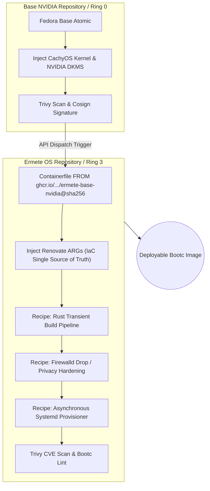

<div align="center">
  <h1>🦅 Ermete OS (Layer 1: Ring 3)</h1>
  <p><b>An uncompromising, cloud-native, atomic Linux distribution engineered for power-users.</b></p>
</div>

---

**Ermete OS** is a hyper-optimized, immutable operating system built upon Fedora and Universal Blue (`bootc`) technologies. It discards monolithic desktop environments, replacing them with a surgically thin, keyboard-driven Wayland experience written almost entirely in Rust.

Driven by an absolute **Infrastructure-as-Code (IaC)** philosophy, Ermete OS is defined entirely by OCI container recipes. It guarantees unbreakable atomic updates, zero system entropy, and uncompromising privacy.

## 🏗️ Multi-Layer OCI Architecture
Ermete OS strictly follows a multi-repository, decoupled architecture for ultimate determinism.



## 🌟 The Enterprise Manifesto

1. **Zero-Entropy**: The root filesystem is strictly immutable. No system degradation, rot, or state drift over time. Software installation via `dnf` on the live system is mathematically banned.
2. **Zero-Bloat**: Only CLI tools and core infrastructure exist on the host. Weak dependencies are banned (`install_weak_deps=False`).
3. **100% Verified Supply Chain**: Dynamic `curl | bash` or blind binary downloads are forbidden. External binaries are managed via a centralized `Containerfile ARG` manifest. The entire OS is pinned exclusively to immutable cryptographic digests (`@sha256`), eliminating reliance on mutable tags like `:latest`.
4. **Autonomous Maintenance**: The OS heals and updates itself via the native `bootc-fetch-apply.timer`. Renovate Bot detects upstream releases, recalculates SHA256 hashes, and pins Docker images. The pipeline compiles, scans with **Trivy** to block CVEs, and signs the deployment via Sigstore/Cosign OIDC without manual intervention.

---

## 🛡️ Paranoid Hardening & "Zero-Trust" Security

Ermete OS implements extreme military-grade security defaults, completely overhauling standard Linux paradigms. It ensures maximum operability while remaining an impenetrable fortress.

### 1. Network Stealth & Isolation
- **Firewall**: Default zone is strictly `drop`. All unsolicited traffic is annihilated without response. mDNS is surgically permitted for local discovery.
- **Privacy Enforcement**: NetworkManager enforces MAC Address Randomization (`stable`) and IPv6 Privacy (`ipv6.ip6-privacy=2`).
- **DNS Protection**: `systemd-resolved` strictly uses `DNSOverTLS=opportunistic` and disables local poisoning via `LLMNR=no`.

### 2. Core & Kernel Defenses
- **Sysctl Hardening**: Mitigates 0-days with `tcp_syncookies=1`, blocks ICMP redirects to prevent MITM attacks, restricts dmesg (`dmesg_restrict=1`), and shields kernel pointers (`kptr_restrict=2`).
- **Memory Coredumps Disabled**: `systemd-coredump` is neutralized (`Storage=none`, `ProcessSizeMax=0`) to ensure Wayland crashes never leak RAM secrets or cryptographic keys to the disk.
- **Anti-DoS Journaling**: `systemd-journald` is capped to `500M` and 1-month retention, preventing malicious processes from exhausting the BTRFS root.
- **SSHD Zero-Trust**: If enabled, SSH rejects root login and completely disables password authentication, requiring modern Pubkey Authentication (Ed25519).

### 3. Local Authentication Sandbox (PAM)
- **Brute-Force Defense**: `faillock.conf` locks user and root accounts for 15 minutes after 3 failed login attempts.
- **Password Quality**: `pwquality.conf` enforces a minimum of 14 characters and 3 class types.

### 4. Self-Healing & Resilience
- **Greenboot Rollbacks**: If the OS fails to reach the network (checked via a 10s cryptographic curl timeout to 1.1.1.1) or the Wayland UI (`greetd`) fails, the system automatically logs the failure and performs a native OSTree rollback to the previous working layer.
- **BTRFS Snapshots**: Instead of arbitrary timers, `/var/home` backups (`ermete-home-snapshot.service`) are elegantly tied to `ostree-finalize-staged.service`, capturing the state precisely milliseconds before an OTA update is applied.

---

## ⚡ Extreme Performance & Wayland Stack
- **ZRAM Compressed Memory**: 100% RAM allocation dynamically compressed via **ZSTD** (`vm.swappiness=150`).
- **Systemd User Orchestration**: The Wayland compositor (Niri) does not spawn processes imperatively. Everything is handled cleanly by `systemd --user` binding to `niri-session.target`, ensuring graceful teardown and infinite idempotency.
- **The Stack**:
  - Compositor: **Niri** (Scrollable Tiling). Hardware accelerated with `GBM_BACKEND=nvidia-drm` and `WLR_NO_HARDWARE_CURSORS=1`.
  - Status Bar: **Ironbar** (Floating, transparent).
  - App Launcher: **Anyrun** (Compiled offline dynamically).
  - Terminal: **Alacritty** (GPU-accelerated).

---

## 📦 Segregated Software Management
Due to root immutability, the traditional `.exe` or `dnf install` paradigm is obliterated:
1. **Graphical Applications**: Exclusively confined to **Flatpak** (via Flathub). Protected globally by `flatpak override --system --device=dri --socket=wayland` to guarantee NVIDIA GPU acceleration and Wayland IPC sandboxing.
2. **CLI Utilities**: Managed via **Nix** Package Manager (seamlessly exposed in `/etc/profile.d/nix.sh`).
3. **Destructive Experiments**: Handled via integrated **Distrobox** containers.

---

## 🧬 Layer 1: Bill of Materials (BOM) & Manifesto Compliance
Every package in Ring 3 is surgically selected to adhere to the "Zero-Bloat" and "Zero-Entropy" manifesto, replacing traditional monolithic Linux tools with hyper-modern, secure, and declarative equivalents.

1. **Rust Core Utilities (`eza`, `bat`, `fd-find`, `ripgrep`, `nushell`)**:
   - *Justification (Zero-Bloat & Security)*: We mathematically eradicated the legacy GNU coreutils. These memory-safe Rust alternatives are blisteringly fast, natively parallelized, and completely eliminate whole classes of memory vulnerabilities from the Ring 3 base.
2. **The Terminal IDE (`neovim`, `lazygit`, `ananicy-cpp`)**:
   - *Justification (Strict Segregation)*: Engineered for extreme power users. The IDE is built around Neovim (LazyVim). However, to respect "Zero-Bloat", massive compilers (`gcc`, `make`) are strictly **omitted** from the host OS `dnf` installation. All compilations must happen elegantly inside Nix environments. `lazygit` is retained as a lightweight CLI utility, while `ananicy-cpp` autonomously manages process niceness for zero-latency typing.
3. **Wayland & Compositor Stack (`niri`, `anyrun`, `ironbar`, `alacritty`)**:
   - *Justification (Dichiaratività Assoluta)*: We reject massive Desktop Environments (like GNOME/KDE) in favor of the Niri scrollable-tiling compositor. To eliminate layer bloat during the OCI build, Rust-based GUI components (`anyrun`, `ironbar`) are compiled asynchronously in isolated multi-stage builders and copied statically (`COPY --from`) into the final image as pure binaries.
4. **Nix Package Manager**:
   - *Justification (Zero-Entropy & Immutable Development)*: The ultimate realization of the Manifesto. By physically baking Nix into the immutable rootfs (`COPY --from=build-nix /nix /nix`), we enable users to spawn declarative, mathematically reproducible development environments (`nix-shell`) without running heavyweight container daemons.
5. **XDG Portals & Pipewire (`xdg-desktop-portal-*`, `wireplumber`)**:
   - *Justification (Zero-Trust Sandboxing)*: Since graphical applications are strictly confined to Flatpaks, the OS must provide infallible declarative API bridges. Portals guarantee that no Flatpak can access the host filesystem or screen without explicit DBus authorization.
6. **Omni-Vision Diagnostics (`sysstat`, `bpftool`, `drm_info`, `wayland-utils`)**:
   - *Justification (Bedrock Analysis)*: Empowers the user to inspect the system from Ring 0 (eBPF traces) up to Ring 3 (Wayland buffers) directly from the terminal, avoiding GUI-based resource monitors that pollute the OS.

---

## 🚀 Deployment (Bare Metal Installation)

### Zero-Touch Provisioning (Kickstart)
The repository includes a ready-to-use `ermete-install.ks` Kickstart file, designed for advanced power-users. It allows you to generate an installer ISO that configures the system automatically:
- Installs via `ostreecontainer` directly from the GitHub Container Registry.
- Leaves partitioning up to the user, expecting an encrypted **LUKS2** volume and **BTRFS** layout.
- Disables root passwords and provisions the `wheel` user solely via SSH Ed25519 public keys.
- Pre-enables firewalld and sshd.

To generate the ISO using `bootc-image-builder`:
```bash
sudo podman run \
    --rm -it --privileged --pull=newer \
    --security-opt label=type:unconfined_t \
    -v $(pwd)/output:/output \
    -v $(pwd)/ermete-install.ks:/config.ks \
    quay.io/centos-bootc/bootc-image-builder:latest \
    --type iso --kickstart /config.ks \
    ghcr.io/patapem/ermete-os:latest
```

*Note on Encryption:* Once installed, bind your LUKS2 partition to the TPM2 chip for seamless automatic unlocking tied to Secure Boot:
`sudo systemd-cryptenroll --wipe-slot=tpm2 --tpm2-device=auto --tpm2-pcrs=0+2+7 /dev/mapper/root`

### In-Place Mutation
If you are currently running Fedora Workstation or Silverblue, atomically mutate your root filesystem:
```bash
sudo bootc switch ghcr.io/patapem/ermete-os
```
