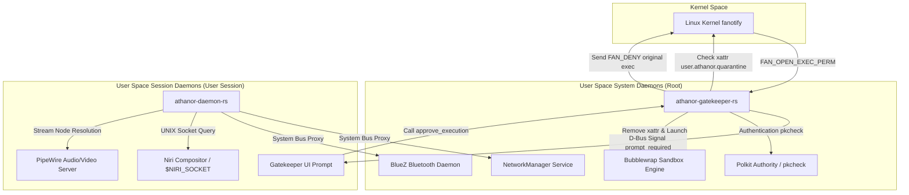

# Central Daemons Architecture: `athanor-daemon-rs`, `athanor-gatekeeper-rs` and IPC / Polkit Security

## 1. Architectural Overview

The core daemons of Athanor OS orchestrate system state, power XDG Desktop Portals integration, maintain ACID user settings persistence, and enforce zero-trust kernel execution security.

The architecture is anchored by two fundamental daemons:
1. **`athanor-daemon-rs` (Settings Engine & Desktop Portals)**: Executes in the user **D-Bus Session Bus** context (with a secondary connection to the System Bus for system services). Manages ACID settings state, acts as proxy for NetworkManager and BlueZ, handles speech synthesis, and serves XDG Desktop Portals (Settings, ScreenCast, RemoteDesktop).
2. **`athanor-gatekeeper-rs` (Zero-Trust Execution Gatekeeper)**: Runs as a privileged **Root Systemd Service** registered on the **D-Bus System Bus**. Intercepts binary execution attempts in real time via the Linux kernel `fanotify` subsystem, enforcing Bubblewrap (`bwrap`) sandbox enclaves for unverified or quarantined binaries.

Both daemons are engineered in **Pure Rust**, leveraging the `mimalloc` high-performance memory allocator and `zbus 5.x` async D-Bus IPC.

---

## 2. In-Depth Analysis: `athanor-daemon-rs` (Core & Desktop Services)

### 2.1 Module Architecture & Actor/Channel Model

`athanor-daemon-rs` orchestrates system state via an asynchronous Tokio model powered by `tokio::sync` channels (`watch`, `mpsc`, `oneshot`).

```text
                               ┌──────────────────────────────────────────────┐
                               │            athanor-daemon-rs                  │
                               │           (D-Bus Session Bus)                │
                               └──────────────────────┬───────────────────────┘
                                                      │
         ┌───────────────────┬───────────────────────┼───────────────────────┬───────────────────┐
         │                   │                       │                       │                   │
┌────────▼────────┐ ┌────────▼────────┐    ┌─────────▼─────────┐   ┌─────────▼─────────┐ ┌────────▼────────┐
│   bedrock.rs    │ │   settings.rs   │    │    network.rs     │   │   bluetooth.rs    │ │ portal_screencast│
│ os.athanor.      │ │ org.athanor.     │    │ os.athanor.Bedrock.│   │ os.athanor.Bedrock.│ │ org.freedesktop. │
│ Bedrock         │ │ Settings        │    │ Network           │   │ Bluetooth         │ │ impl.portal.*    │
└────────┬────────┘ └────────┬────────┘    └─────────┬─────────┘   └─────────┬─────────┘ └────────┬────────┘
         │                   │                       │                       │                    │
         │ (Proxy)           │ (ACID Watch/Store)    │ (System Bus Proxy)    │ (System Bus Proxy) │ (UNIX Socket /
         ▼                   ▼                       ▼                       ▼                    PipeWire)
 ┌───────────────┐   ┌───────────────┐       ┌───────────────┐       ┌───────────────┐    ┌───────────────┐
 │ AudioWorker   │   │settings.json  │       │NetworkManager │       │    BlueZ      │    │  Niri Socket  │
 │ D-Bus Service │   │(Atomic Temp)  │       │  System Bus   │       │  System Bus   │    │  / PipeWire   │
 └───────────────┘   └───────────────┘       └───────────────┘       └───────────────┘    └───────────────┘
```

#### Core Components:

1. **`bedrock.rs` (`os.athanor.Bedrock`)**:
   - **Responsibility**: System volume and core audio state management via `AtomicU64`.
   - **IPC Flow**: Interacts with `os.athanor.AudioWorker` service via `AudioWorkerProxy`.

2. **`settings.rs` (`org.athanor.Settings` / `os.athanor.Bedrock.Settings`)**:
   - **Decentralized Domain States**: Maintains domain micro-states `AppearanceDomainState` (light/dark mode, accent colors, wallpaper, dock configuration, True Tone) and `VoiceOverDomainState` (accessibility voiceovers).
   - **Atomic Persistence**: Flushes settings to domain JSON files (`appearance.json`, `voiceover.json`) using atomic temporary writes and renames under `~/.config/athanor/`.
   - **Async Actor Loop**: Uses an `mpsc::channel(32)` actor loop processing `SettingsCommand` messages paired with `oneshot::Sender` channels. State mutations trigger updates on domain-specific `watch::Sender` channels, notifying only subscriber services.

3. **`network.rs` (`os.athanor.Bedrock.Network`)**:
   - **NetworkManager Integration**: Connects to the **System D-Bus** to interact with `org.freedesktop.NetworkManager`.
   - **Concurrent AP Scanning**: Employs `futures_util::future::join_all` and `tokio::join!` to concurrently query Wi-Fi devices (`device_type == 2`) and scan Access Points (SSID, signal strength, WPA/RSN security flags).
   - **Enterprise Wi-Fi & VPN**: Configures 802.1x EAP (PEAP) networks and VPN tunnels (OpenVPN/WireGuard) by assembling `zbus::zvariant::Value` variant dictionaries passed to `NmSettingsProxy.add_connection`.

4. **`bluetooth.rs` (`os.athanor.Bedrock.Bluetooth`)**:
   - **BlueZ Integration**: Interoperates with BlueZ (`org.bluez`) on `/org/bluez/hci0` via `PropertiesProxy` and `ObjectManagerProxy` to enumerate paired/connected Bluetooth peripherals.

5. **`portal.rs` & `portal_screencast.rs` (Strict Fail-Closed XDG Desktop Portal)**:
   - **Zero-Trust Fail-Closed Policy**: If permission prompts fail, or if Micro-VM DBus authentication cannot be established via `org.athanor.Hypervisor`, the portal enforces a strict `return false` (denial by default). String-based application ID spoofing is architecturally rejected.
   - **`org.freedesktop.impl.portal.Settings`**: Exposes desktop theme tokens read reactively from `watch::Receiver<AppearanceDomainState>`.
   - **`org.freedesktop.impl.portal.ScreenCast`**: Rejects mocked or insecure `/dev/null` PipeWire stream passing. Acknowledges missing features explicitly via DBus Errors instead of presenting a fake success surface.

6. **`voiceover.rs` (`os.athanor.VoiceOver`)**:
   - Monitors state from `watch::Receiver<VoiceOverDomainState>` and forwards text payloads to `os.athanor.VoiceOverWorker`.

7. **`qos.rs` (App QoS Observer)**:
   - Evaluates background process PIDs and applies high nice values (`nice 19`) via `libc::setpriority(PRIO_PROCESS, pid, 19)` to preserve CPU cycles for foreground interactive tasks.

---

## 3. In-Depth Analysis: `athanor-gatekeeper-rs` (Zero-Trust Execution Gatekeeper)

`athanor-gatekeeper-rs` is the root security enforcement engine. It prevents execution of untrusted or unverified binaries downloaded from external channels.

### 3.1 Kernel Interception via `fanotify`

The daemon opens a non-blocking `fanotify` file descriptor:
```rust
libc::fanotify_init(
    FAN_CLASS_CONTENT | FAN_NONBLOCK,
    (libc::O_RDONLY | libc::O_LARGEFILE) as u32
)
```
It attaches monitoring marks on critical mount points (`/var/home`, `/tmp`, `/var/tmp`, `/opt`):
```rust
libc::fanotify_mark(
    fanotify_fd,
    FAN_MARK_ADD | FAN_MARK_MOUNT,
    FAN_OPEN_EXEC_PERM,
    libc::AT_FDCWD,
    path.as_ptr()
)
```
When any process attempts binary execution on these filesystems, the Linux kernel halts execution pending explicit `FAN_ALLOW` or `FAN_DENY` authorization from Gatekeeper.

### 3.2 Quarantine Inspection & Sandbox Approval Flow

```text
[ Kernel Execution Request ] ──► (fanotify: FAN_OPEN_EXEC_PERM)
                                          │
                                          ▼
                         ┌─────────────────────────────────┐
                         │ Is file xattr quarantined?      │
                         │ (user.athanor.quarantine check)  │
                         └────────────────┬────────────────┘
                                          │
                   ┌──────────────────────┴──────────────────────┐
                   │ NO                                          │ YES
                   ▼                                             ▼
        [ Send FAN_ALLOW ]                     [ Freeze Execution & Register fd_id ]
       (Allow Native Exec)                                       │
                                                                 ▼
                                                  [ Emit D-Bus Signal: prompt_required ]
                                                                 │
                                                                 ▼
                                                  [ User Interaction in Gatekeeper UI ]
                                                                 │
                                                                 ▼
                                                  [ Invocation of approve_execution(fd_id) ]
                                                                 │
                                                                 ▼
                                                  [ Polkit Check: pkcheck os.athanor.gatekeeper.approve ]
                                                                 │
                                      ┌──────────────────────────┴──────────────────────────┐
                                      │ Success                                             │ Failed
                                      ▼                                                     ▼
                       [ Remove xattr user.athanor.quarantine ]                    [ Send FAN_DENY ]
                                      │                                           (Block Exec)
                                      ▼
                       [ Spawn binary inside Bubblewrap ]
                       (bwrap --unshare-all ...)
                                      │
                                      ▼
                       [ Send FAN_DENY to unsandboxed original ]
```

#### Detailed Execution Sequence:

1. **Event Detection**: The async event loop driven by `tokio::io::unix::AsyncFd` reads `fanotify_event_metadata`.
2. **Extended Attribute Inspection (TOCTOU-Safe)**: Resolves paths via `/proc/self/fd/<fd>` and performs non-blocking checks via `tokio::task::spawn_blocking` for the `user.athanor.quarantine` extended attribute.
3. **Unquarantined Execution**: If the attribute is absent, immediately emits `FAN_ALLOW` to the kernel and closes the descriptor.
4. **Interception & Prompt UI**: If the binary is quarantined:
   - Assigns a unique `fd_id` and records the file descriptor in a thread-safe `pending_events` map.
   - Emits D-Bus signal `prompt_required(fd_id, app_name)` on the **System D-Bus**.
   - The UI (`gatekeeper-ui`) renders a modal prompting for user authorization.
5. **Approval & Bubblewrap Sandboxing**:
   - User approves execution via D-Bus method call `approve_execution(fd_id)`.
   - **Polkit Check**: Gatekeeper executes `pkcheck --system-bus-name <sender> --action-id os.athanor.gatekeeper.approve`.
   - Upon authorization, removes `user.athanor.quarantine` extended attribute.
   - Spawns target binary inside a restricted **Bubblewrap (`bwrap`)** sandbox (`--unshare-all`, `--share-net`, `--ro-bind` for `/usr`, `/lib`, `/lib64`, `/etc`, `--proc /proc`).
   - Emits **`FAN_DENY`** to the kernel for the original unsandboxed execution request, handing off execution exclusively to the sandboxed child process.

---

## 4. IPC Security, Polkit & D-Bus Policies

### 4.1 Polkit Action Identifiers & D-Bus Interfaces

| Daemon | D-Bus Bus | D-Bus Interface | Polkit Action (`action-id`) | Description |
| :--- | :--- | :--- | :--- | :--- |
| `athanor-gatekeeper-rs` | **System Bus** | `os.athanor.Gatekeeper` | `os.athanor.gatekeeper.approve` | Approval & sandboxed execution of quarantined binaries |
| `athanor-gatekeeper-rs` | **System Bus** | `os.athanor.Gatekeeper` | `os.athanor.gatekeeper.root` | Elevation request to root privileges (with FIDO2 fallback) |
| `athanor-daemon-rs` | **Session Bus** | `org.athanor.Settings` | N/A | Modification of user settings & desktop theme tokens |
| `athanor-daemon-rs` | **Session Bus** | `os.athanor.Bedrock` | N/A | Adjustment of system audio/volume parameters |

### 4.2 Security Audit & Hardening Directives

Source code auditing highlighted the following security considerations:

1. **Polkit Verification Enforcement**:
   - Polkit verification routines must strictly execute async calls to `zbus::fdo::AuthorityProxy` or invocation of `pkcheck` prior to accepting system state mutations.
2. **TOCTOU & Monotonic ID Hardening**:
   - `fd_id` identifiers must be paired with the D-Bus unique sender and utilize random UUID v4 values to prevent brute-force hijacking of `approve_execution` calls.
3. **Input Sanitization**:
   - Subprocess invocations for desktop theme enforcement (`dconf`, `matugen`, `wlsunset`, `swww`) must sanitize string parameters passed via D-Bus payload structures.
4. **Panic Elimination**:
   - All `unwrap()` calls during D-Bus variant deserialization must be converted to explicit `match` blocks or `?` error propagation emitting `zbus::fdo::Error::Failed`.

---

## 5. Architectural Topology & Dependency Mapping



