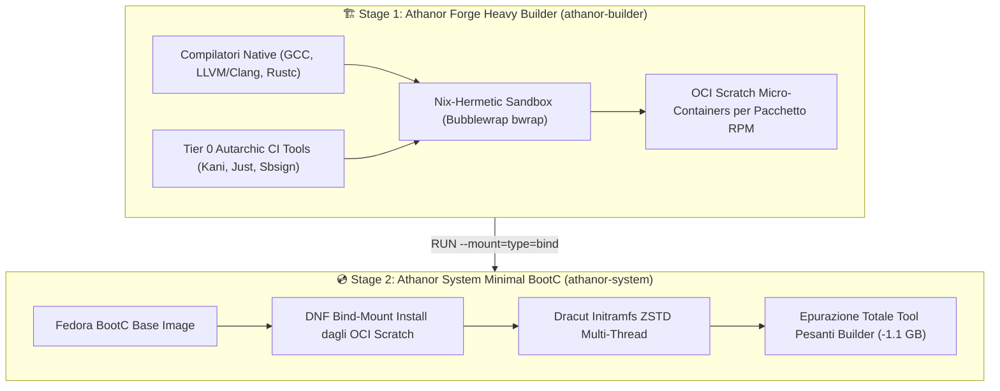

# 🌋 Athanor Forge — Private OCI Micro-Container & RPM Forge

> 📚 **Deep-Dive Technical Documentation:** Per l'architettura dettagliata della pipeline CI/CD, l'idempotenza e il meccanismo deterministico Nix-Hermetic, consulta **[Build System & CI/CD Pipeline](../docs/architecture/doc_build_system.md)** e **[Desktop UI Stack](../docs/architecture/doc_shell_ui.md)**.

**The absolute zero-trust, high-performance CachyOS-level compiler and package builder for Athanor OS.**

Athanor Forge is the automated CI/CD engine responsible for generating all the custom software, UI components, and configurations that make up Athanor OS. It enforces aggressive compiler optimizations (`-O3`, `-march=x86-64-v3`, `-flto=auto`, `mold` linker) across all custom packages.

Instead of a monolithic script, Athanor Forge distributes each package as a granular **Micro-Container OCI artifact** or RPM.

---

## 🏗️ The Micro-Container OCI Architecture

Every single package or tool has its own independent CI/CD build job producing an isolated `scratch` container image:
- **Zero Monolithic Bloat**: Granular failure isolation and pristine per-package history. If one package fails to build, it doesn't halt the entire Forge, preventing cascading failures.
- **Absolute RPM Encapsulation**: Every system tweak, udev rule, SELinux policy, and GTK application is encapsulated inside a clean `.spec` and `.rpm`. 
- **Tiered Dependency System**: Packages are built in tiers (Tier 0 to Tier 3) ensuring that foundational base packages (like `athanor-base-config`) are built and available before higher-level applications (like `athanor-shell-rs`) attempt to compile.

---

## 📦 Complete Package Registry (`specs/`)

| Spec Directory | RPM Name | Purpose & Architecture |
| :--- | :--- | :--- |
| `athanor-ananicy` | `athanor-ananicy` | Process priority & low-latency scheduling daemon |
| `athanor-base-config` | `athanor-base-config` | Core filesystem hierarchy, RPM Fusion repos, sysusers |
| `athanor-bat` | `athanor-bat` | Syntax-highlighting inspection utility |
| `athanor-bibata` | `athanor-bibata` | Bibata Modern HiDPI cursor theme |
| `athanor-cliphist` | `athanor-cliphist` | Wayland clipboard history daemon |
| `athanor-daemon-rs` | `athanor-daemon-rs` | Pure Rust D-Bus system monitoring daemon |
| `athanor-dart-sass` | `athanor-dart-sass` | Sass compiler for GTK4 stylesheet generation |
| `athanor-desktop-ui` | `athanor-desktop-ui` | Wayland Niri session wrappers and startup scripts |
| `athanor-doctor` | `athanor-doctor` | Rust CLI diagnostics & hardware validation tool |
| `athanor-ide-bootstrap` | `athanor-ide-bootstrap` | Developer toolchain bootstrap & IDE configurations |
| `just` | `just` | Autarchic command runner compiled in Rust with `-O3 -march=x86-64-v3` & mold |
| `kani-verifier` | `kani-verifier` | Kani Rust Formal Verification Engine compiled natively (`kani-driver`, `cargo-kani`) |
| `athanor-matugen` | `athanor-matugen` | Material You dynamic wallpaper color palette generator |
| `athanor-nix-support` | `athanor-nix-support` | Multi-user Nix package manager integration |
| `athanor-selinux` | `athanor-selinux` | Compiled `.pp` SELinux policies for `bootupd` and `scx` |
| `athanor-settings-rs` | `athanor-settings-rs` | Native Rust GTK4 System Settings application |
| `athanor-shell-rs` | `athanor-shell-rs` | Native Rust GTK4 Topbar, Control Center & **Big Tech Login Greeter** |
| `athanor-starship` | `athanor-starship` | Universal cross-shell prompt |
| `athanor-store-rs` | `athanor-store-rs` | Native Rust GTK4 Flatpak & System App Store |
| `athanor-system-config` | `athanor-system-config` | udev rules, presets, `/etc/greetd/config.toml` (Cage Kiosk) |
| `athanor-system-services` | `athanor-system-services` | Systemd service units & timers |
| `athanor-system-tweaks` | `athanor-system-tweaks` | Virtual memory, ZRAM, and I/O latency sysctl tweaks |
| `uki-tools` | `uki-tools` | Unified Kernel Image & Secure Boot toolchain (`sbsigntools` + `systemd-ukify`) |

*(Note: `azoth` is built via its own standalone pipeline in the `kernel/` directory due to its complexity and `ccache` requirements).*

---

## ⚡ The 100% Rust UI Stack & Kiosk Login Greeter

JavaScript/GJS/NodeJS engines are strictly prohibited in user-space UI for Athanor OS:
1. **Login Greeter**: `athanor-shell-rs --greeter` runs inside a lightweight **`cage`** Wayland Kiosk session (configured by `athanor-system-config`).
2. **Desktop Environment**: `athanor-shell-rs` + `athanor-settings-rs` + `athanor-store-rs` running on the **Niri** scrollable tiling compositor.

---

## 🛡️ Ecosistema di CI/CD Autarchico & Topologia Multi-Stage Build

La Forgia di Athanor OS non scarica mai binari di build da repository esterni di terze parti. I principali strumenti di CI, verifica formale e firma digitale sono scritti/assimilati ed assemblati autonomamente nel **Tier 0**:

### 1. 🛡️ Toolchain Assimilata (Tier 0 Self-Hosted)
- **`kani-verifier`**: Motore di verifica formale e *bounded model checking* per il codice Rust dell'OS. Genera `kani-driver` e `cargo-kani` per validare le proprietà di sicurezza della memoria senza dipendenze da binari esterni.
- **`just`**: Task runner nativo Rust compilato in Forge con `-O3`, `-march=x86-64-v3`, `-fuse-ld=mold` e ThinLTO per l'orchestrazione deterministica dei workflow.
- **`uki-tools`**: Pacchetto di firma e assemblaggio UKI (Unified Kernel Image) che unifica `sbsigntools` (`sbsign`, `sbverify`, `sbattach`, `sbkeysync`, `sbvarsign`) e `systemd-ukify` (`ukify`). Garantisce l'autonomia totale nelle procedure di Secure Boot.

### 🏗️ Workflow Multi-Stage: Il Builder Pesante produce l'OS Leggero

1. **Stage 1 (Heavy Builder)**: Il contenitore `athanor-builder` contiene la toolchain pesante completa e genera individualmente gli RPM di Forge in micro-container `scratch`.
2. **Stage 2 (Lightweight Bootable System)**: `system/Containerfile` installa gli RPM in un contesto pulito tramite bind-mount, genera l'initramfs con Dracut ed epura l'intera toolchain di build (rimuovendo GCC, LLVM, sorgenti e header C/Rust per un risparmio netto di -1.1 GB).

---

## 🛠️ Build Pipeline (GitHub Actions)

The `forge` workflow (`.github/workflows/forge-orchestrator.yml`) manages the automated build of all RPMs:
- It processes each tier sequentially.
- Generates the RPM files via `rpmbuild` inside clean container environments.
- Skips GitHub Actions caching (`actions/cache`) for massive RPM artifacts to prevent runner disk exhaustion (`No space left on device` errors).
- Exposes the final compiled RPMs directly to the `system` pipeline, which installs them in the final OCI image without needing GPG signature verification (since they are generated internally).

